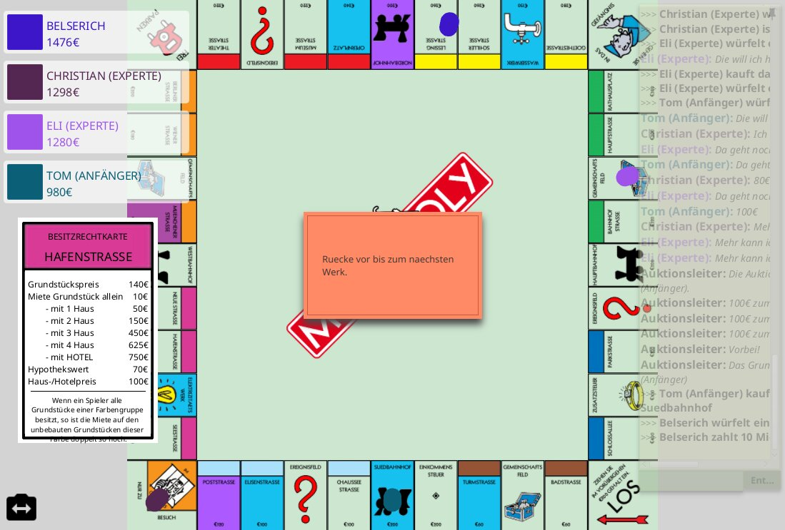

# General Information
An implementation of the classic board game **Monopoly**.
Made by five students at BTU Cottbus-Senftenberg (Chair of Software Engineering) in 2017 during a software internship module.



More screenshots down below!

Features:
- play alone or with your friends over the local network (chat included)
- easy/hard bots (+ interaction over chat)
- a 3D animated model of the game board
- street auctions (optional game rule)
- rule screen
- includes unit tests

Facts:
- This game was planned and developed over a period of 6 months.
- It was first implemented as a console game to prevent GUI dependencies and ease feature testing.
- The release was tested by letting five bots play a 3-hour-game against each other.
- Nobody won the test game (ironically proving that even computers can't end a monopoly game).

# Build Instructions
Build dependencies are managed by Gradle. 
You need a working Gradle installation (tested with 7.4) to build and run the project. 
In the working directory, call 
``` 
gradle run 
```
It automatically compiles and runs the game.
Run `gradle test` to run the unit tests.

# Developers
Made with <3 by:

Achilles Christian Prinz
prinzach@b-tu.de

Maximilian Bels
maximilianbels@gmail.com

Eleonora Kostova
eli.kosstova@gmail.com

John Augat
augatjohn@b-tu.de

Patrick Hartmut Christian Kalweit
kalwepat@b-tu.de

# More Screenshots


